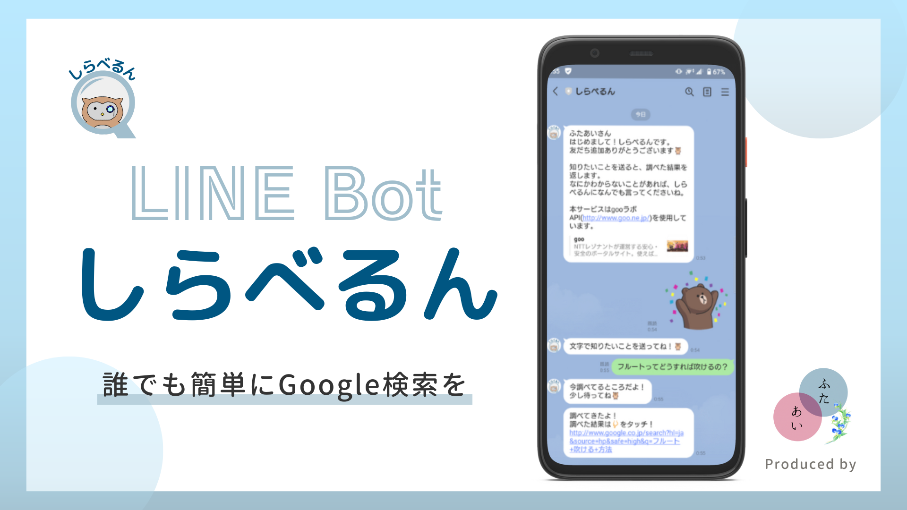
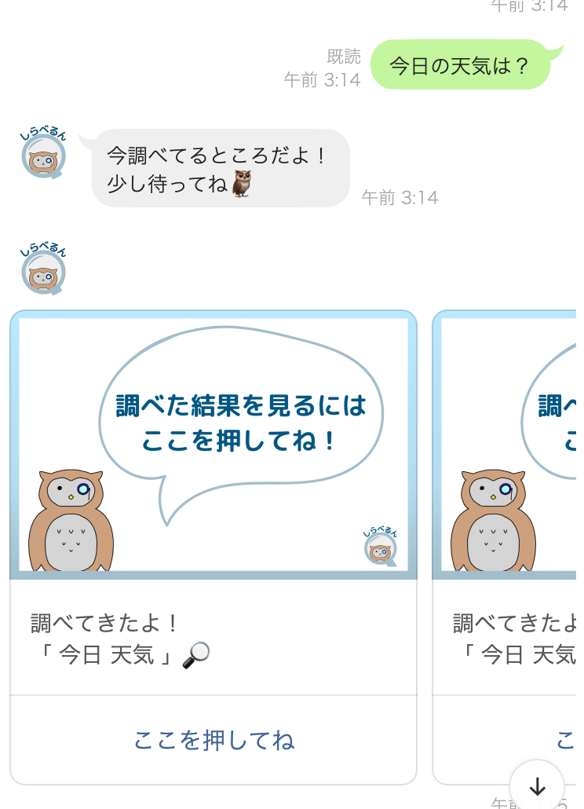
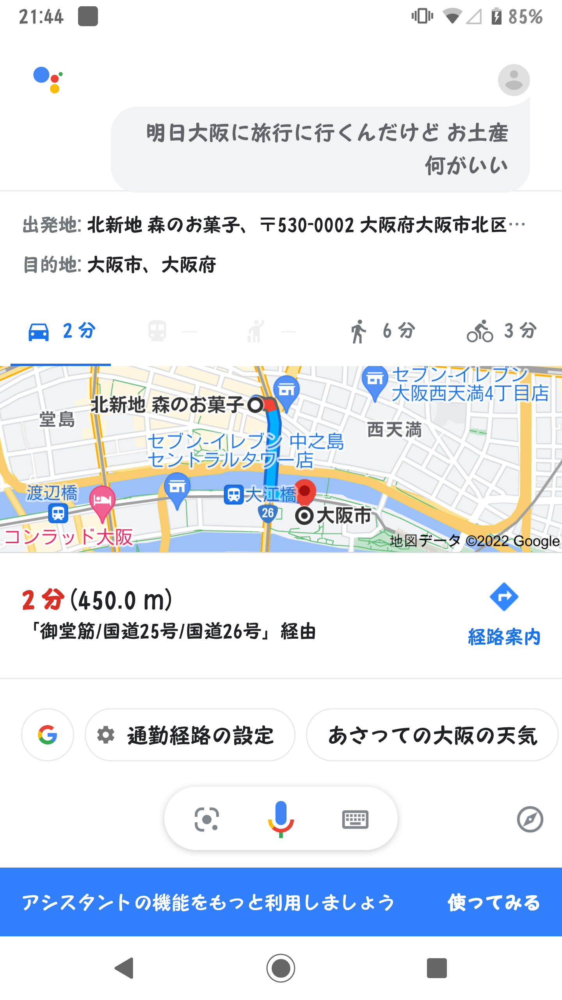
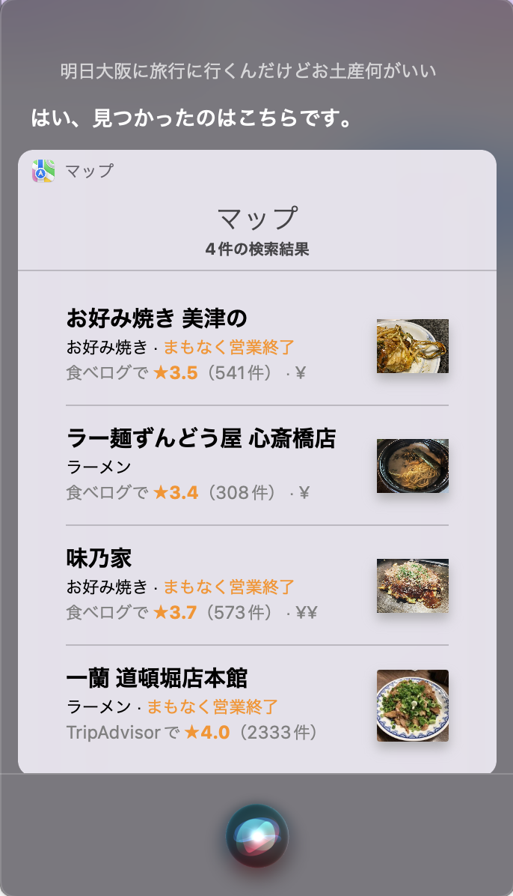
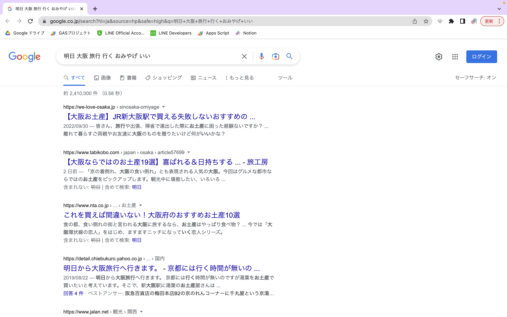

# LINE Bot「しらべるん」

## 製品概要
### 背景(製品開発のきっかけ、課題等）

IT格差の多くはIT技術の使い方が分からないため発生します。

分からないのならば調べれば良い。

しかしITに不慣れな高齢者は、Google検索を上手く活用できません(検索ワードの選定など)。

このような高齢者も、多くの人はLINEを使用しています。

そこで、わからないこと・知りたいことをチャット(口語)で送信すると、適切なキーワードでGoogle検索した結果を返すLINE Botを作成しました。

### 製品説明（具体的な製品の説明）
### 特長
#### 1. 特長1

**最も利用されているSNSであるLINEを利用**

LINEの普及率は2022年の調査でも **約7割** ほど。

60歳以上も **57.9%** の人がLINEを使っています。

また、60歳以上でも **59%** の人が、LINE公式アカウントを友達追加しているというデータもあります。

そのため、ITに不慣れな人でも使いやすい製品になっています。

参考: [【消費者のLINE公式アカウント利用実態調査】
コロナ禍で約2人に1人が新たに登録、主な目的は「情報収集」「自宅時間を楽しむ」。 60代以上の3人に1人が「行政・自治体」アカウントを追加。 約7割がチャットで質問や相談をしたい・したことがあると回答。
](https://mobilus.co.jp/press-release/24414)

#### 2. 特長2

**口語から検索ワードを生成するアルゴリズム** 

口語から適切な検索ワードを作成するにあたり、以下の技術を用いました。

- 固有名詞抽出(gooラボ 固有表現抽出API)
- 形態素解析(gooラボ 形態素解析API)
- Lemmatisationによる置き換え(Python spacyライブラリ)
- その他、それぞれの形態素に合わせた活用系の選定

#### 3. 特長3

**Google検索によるサジェスト結果も表示**

思い通りの結果が得られなかった、もっと詳しく調べたい人向けに、サジェスト結果も送信しています。

### 解決出来ること

すでにGoogle検索はDX化されていると思う人もいるかもしれませんが、Google検索に必要な検索ワードは依然として人間が考えています。

そこで、私たちは検索ワードを考えるという作業をDX化しようと考えました。

これにより、ITが不慣れな人でも気軽にGoogle検索を行えるようになります。

これは、IT格差が広がっていくことを止めることができるでしょう。

### 今後の展望
* 文脈解析
  
  文脈解析を行うことで、より正確な検索ワードを選定します。
* APIの処理の軽量化

  より高速に返信を返します。

* エンジニアに特化したモードを追加
  
  プログラミング初学者は適切な検索ワードが思いつかない場合が多いです。

  そのため、プログラミング学習に特化したモードも作成します。

### 注力したこと（こだわり等）
* 口語から適切な検索ワードを作成するところ
  
  短い開発期間の中で完成させるために、自らエンティティや機械学習などのデータを用意せず、APIや既存のライブラリを組み合わせることで検索ワードを作成しました。

* テンプレートメッセージの使用

  テキストメッセージではなく、以下のようなカルーセルテンプレートを使用することで、見やすいUIにこだわりました。

  

### 競合他サービスなどとの比較
「明日大阪に旅行に行くんだけど、おみやげ何がいい？」という文章を用いた際の結果の比較
* Googleアシスタント
  
  

  大阪市から森のお菓子というお店までの経路を表示
* Siri
  
  

  大阪の飲食店を複数表示
* 本製品
  
  
  
  大阪のオススメお土産をまとめているサイトを表示

## 開発技術
### 活用した技術

#### 言語
* Google Apps Script(GAS)
* Python

#### API・データ
* gooラボAPI
  * 固有表現抽出API
  * 形態素解析API
* GoogleSuggestAPI
* 自作API
  * 動詞を終止形に変換するAPI

#### フレームワーク・ライブラリ・モジュール
* spacy(Python)
* FastAPI(Python)

<!-- #### デバイス
* 
*  -->

### 独自技術
#### ハッカソンで開発した独自機能・技術
* 口語から検索ワードを生成するアルゴリズム([/improve-search-query.gs](https://github.com/jphacks/C_2211/blob/develop/improve-search-query.gs))
  
  - 固有名詞の抽出
  - 形態素分析
  - 動詞を終止形に変換
  - 不要なワードの削除
  - 形容詞を終止形に変換

  などを組み合わせることで、口語から適切な検索ワードを作成しました。
  
[発表スライド](https://www.canva.com/design/DAFPgKl_cmQ/GSE8p9Sq-mtpE9X1Ac6pXQ/view?utm_content=DAFPgKl_cmQ&utm_campaign=designshare&utm_medium=link&utm_source=publishsharelink)
  
<!-- * 特に力を入れた部分をファイルリンク、またはcommit_idを記載してください。 -->

<!-- #### 製品に取り入れた研究内容（データ・ソフトウェアなど）（※アカデミック部門の場合のみ提出必須）
* 
*  -->
