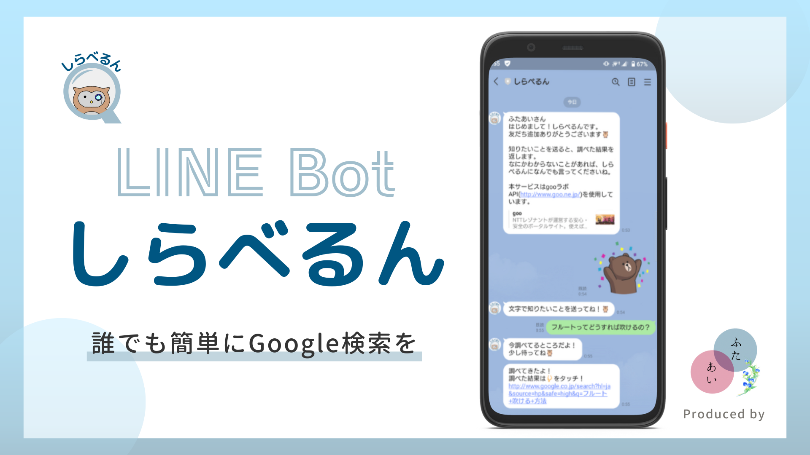

# LINE Bot「しらべるん」

↑↑ 友だち追加はこちらから ↑↑

## 製品概要
### 背景(製品開発のきっかけ、課題等）

IT格差の多くはIT技術の使い方が分からないため発生します。

分からないのならば調べれば良い。

しかしITに不慣れな高齢者は、Google検索を上手く活用できません(検索ワードの選定など)。

このような高齢者も、多くの人はLINEを使用しています。

そこで、わからないこと・知りたいことをチャット(口語)で送信すると、適切なキーワードでGoogle検索した結果を返すLINE Botを作成しました。

### 製品説明（具体的な製品の説明）
### 特長
#### 1. 特長1

**最も利用されているSNSであるLINEを利用**

LINEの普及率は2022年の調査でも **約7割** ほど。

60歳以上も **57.9%** の人がLINEを使っています。

また、60歳以上でも **59%** の人が、LINE公式アカウントを友達追加しているというデータもあります。

そのため、ITに不慣れな人でも使いやすい製品になっています。

参考: [【消費者のLINE公式アカウント利用実態調査】
コロナ禍で約2人に1人が新たに登録、主な目的は「情報収集」「自宅時間を楽しむ」。 60代以上の3人に1人が「行政・自治体」アカウントを追加。 約7割がチャットで質問や相談をしたい・したことがあると回答。
](https://mobilus.co.jp/press-release/24414)

#### 2. 特長2

**口語から検索ワードを生成するアルゴリズム** 

口語から適切な検索ワードを作成するにあたり、以下の技術を用いました。

- 固有名詞抽出(gooラボ 固有表現抽出API)
- 形態素解析(gooラボ 形態素解析API)
- Lemmatisationによる置き換え(Python spacyライブラリ)
- その他、それぞれの形態素に合わせた活用系の選定

#### 3. 特長3

**Google検索によるサジェスト結果も表示**

思い通りの結果が得られなかった、もっと詳しく調べたい人向けに、サジェスト結果も送信しています。

### 解決出来ること

すでにGoogle検索はDX化されていると思う人もいるかもしれませんが、Google検索に必要な検索ワードは依然として人間が考えています。

そこで、私たちは検索ワードを考えるという作業をDX化しようと考えました。

これにより、ITが不慣れな人でも気軽にGoogle検索を行えるようになります。

これは、IT格差が広がっていくことを止めることができるでしょう。

### 今後の展望
* 文脈解析
  
  文脈解析を行うことで、より正確な検索ワードを選定します。
* APIの処理の軽量化

  より高速に返信します。

* エンジニアに特化したモードを追加
  
  プログラミング初学者は適切な検索ワードが思いつかない場合が多いです。

  そのため、プログラミング学習に特化したモードも作成します。

### 注力したこと（こだわり等）
* 口語から適切な検索ワードを作成するところ
  
  短い開発期間の中で完成させるために、自らエンティティや機械学習用のデータを用意せず、APIや既存のライブラリを組み合わせることで検索ワードを作成しました。

* テンプレートメッセージの使用

  テキストメッセージではなく、以下のようなカルーセルテンプレートを使用することで、分かりやすいUIにこだわりました。

  
  

### 競合他サービスなどとの比較
「明日大阪に旅行に行くんだけど、おみやげ何がいい？」という文章を用いた際の結果の比較
* Googleアシスタント

  大阪市から森のお菓子というお店までの経路を表示

  

* Siri

  大阪の飲食店を複数表示

  

* 本製品
  
  大阪のオススメお土産をまとめているサイトを表示
  
  
  
  

## 開発技術

### 活用した技術

#### 言語
* Google Apps Script(GAS)
* Python

#### API・データ
* gooラボAPI
  * 固有表現抽出API
  * 形態素解析API
* GoogleSuggestAPI
* Message API(LINE)
* 自作API
  * 動詞を終止形に変換するAPI

#### フレームワーク・ライブラリ・モジュール
* spacy(Python)
* FastAPI(Python)

#### サーバー
* Heroku

<!-- #### デバイス
* 
*  -->

### 独自技術
#### ハッカソンで開発した独自機能・技術
* 口語から検索ワードを生成するアルゴリズム([/improve-search-query.gs](https://github.com/jphacks/C_2211/blob/master/improve-search-query.gs))
  
1. 固有名詞の抽出
    - gooラボAPIの「固有表現抽出API」を使用
1. 動詞を終止形に変換
    - 自作したAPIを使用([/verb-to-terminal-form-API/FastAPI](https://github.com/jphacks/C_2211/blob/master/verb-to-terminal-form-API/main.py))
1. 形態素分析
    - gooラボAPIの「形態素解析API」を使用
1. 不要なワードの削除
    - 形態素解析の結果を受け、形態素の品詞により取捨選択
1. 形容詞を終止形に変換
    - 「い」をつける
1. 検索ワード並び替え・作成
    - 「〇〇 ◯◯ 方法」のように適切な検索ワードになるよう入れ替える

  といったフローで様々なAPIを組み合わせることで、口語から適切な検索ワードを作成しました。
  
[発表スライド](https://www.canva.com/design/DAFPgKl_cmQ/GSE8p9Sq-mtpE9X1Ac6pXQ/view?utm_content=DAFPgKl_cmQ&utm_campaign=designshare&utm_medium=link&utm_source=publishsharelink)
  
<!-- * 特に力を入れた部分をファイルリンク、またはcommit_idを記載してください。 -->

<!-- #### 製品に取り入れた研究内容（データ・ソフトウェアなど）（※アカデミック部門の場合のみ提出必須）
* 
*  -->

## FAQ
* **どうしてGASを使用しているのですか？**

  環境構築が不要で、デプロイが簡単だからです。
  
* **期間中にどの機能を作りましたか？**

  全て、0から作成しました。

* **どうして「Digital Divide x Tech」を選んだのですか？**

  Google検索ができないと、より一層IT格差が広がっていくと考えているからです。

* **なぜ高齢者をターゲット層にしているのですか？**

  デジタルネイティブ世代にはそこまでIT格差がないけれど、高齢者の間ではIT格差が深刻化しているためです。

* **特に難しかったことはなんですか？**

  自作APIのデプロイです。チームメンバー全員がサーバーサイド未経験者だったため、苦労しました。

  色々なサーバーを試した結果、最終的にHerokuを使用しました。
  
* **Herokuを選んだ理由**
  
  Herokuを選定した理由としては、dockerを用意する必要がなかったからです。

* **FastAPIを使用した理由**

  元々Pythonをメイン言語としていること、高速であることなどが理由です。

* **LINE Botのアイコンは自作ですか？**

  はい、フクロウを自分で描き、その他の素材と組み合わせました。

  完全オリジナルです。
  
* **Googleアシスタントの音声認識で全て事足りませんか？**

  [競合他サービスなどとの比較](https://github.com/jphacks/C_2211#%E7%AB%B6%E5%90%88%E4%BB%96%E3%82%B5%E3%83%BC%E3%83%93%E3%82%B9%E3%81%AA%E3%81%A9%E3%81%A8%E3%81%AE%E6%AF%94%E8%BC%83)
  でもあるように、Googleアシスタントでは正確な検索結果が返ってきません。
  
  従って本サービスには確かな価値がございます。

* **何か機械学習的なアプローチはしていないのですか？**

  基本的にはしていません。（固有名詞抽出APIの内部で使っているかも？）
  
  というのも、今回は特定のシチュエーションで（例えば、飲食店検索アプリ内で）行う自然言語処理ではありません。
  
  八百万の単語が出現することになるため、それぞれの単語を分類して学習するために必要な「辞書（エンティティ）」を用意できません。
  
  従って今回は機械学習的なアプローチをせず、日本語の文法的なアプローチを行いました。
  
* **今後サービスを継続して提供する予定はありますか？**

  非常に前向きに検討しております。
  
  本サービスは現段階で一定の価値がある上、まだまだ改良の余地があります。
  
  またランニングコストについても、保守管理の負担はかかるものの金銭的な負担は大きくありません。
  （現状はHerokuの維持費のみ）
  
  ですのでサービスの継続した提供を検討しています。
  
  なお継続的なサービス開発にスポンサードを含め何らかのご支援を頂ける方を募集しております。
  以下アドレスよりご連絡をお待ちしております。
  
  futa.ai.info[ｱｯﾄﾏｰｸ]gmail.com

## メンバー紹介
#### 小代
* 担当: アルゴリズム考案、LINEとの繋ぎ込み
* 得意分野: UI設計、Flutter、人のコードを解読する
* 今回がんばったこと: 人生初のLINE Bot。短い時間でLINEのMessage APIの仕様から理解して実装することを頑張りました。

#### 竹澤
* 担当: API作成・デプロイ、API呼び出し、アイコン・画像等の作成
* 得意分野: Python(特にmusic21)、デザイン
* 今回がんばったこと: 人生初のサーバーサイド。慣れないお絵描きも頑張りました。
